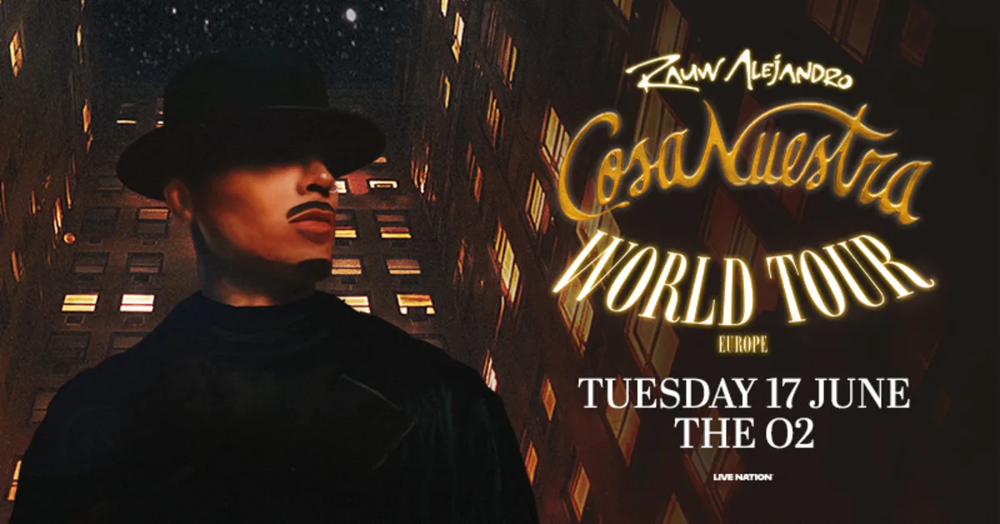

Rauw Alejandro has achieved one of the greatest milestones of his career with the impressive reception of his Cosa Nuestra World Tour in Europe. The tour has visited key cities such as London, Paris, Berlin, Amsterdam, Lisbon and Barcelona, where every concert has been reported as completely sold out. The response from European audiences has been extraordinary, consolidating the artist as one of the global leaders in Latin urban pop.

The show is characterised by high-level production that combines futuristic visuals, precise choreography and a fresh sound that fuses reggaeton, dancehall, Afrobeats rhythms and Caribbean elements. His live band brings a unique energy that has been highly praised by critics and fans alike.

In addition to his music, Rauw shines on stage: his presence, dancing skills and vocal ability make each performance a complete show. For many, this tour marks a turning point in his evolution as a performer.

The European reception demonstrates the artist's international reach and his ability to connect with diverse audiences without losing authenticity. La Cosa Nuestra World Tour is thus positioned as one of the most successful Latin tours of 2025, further elevating Rauw Alejandro's global impact.