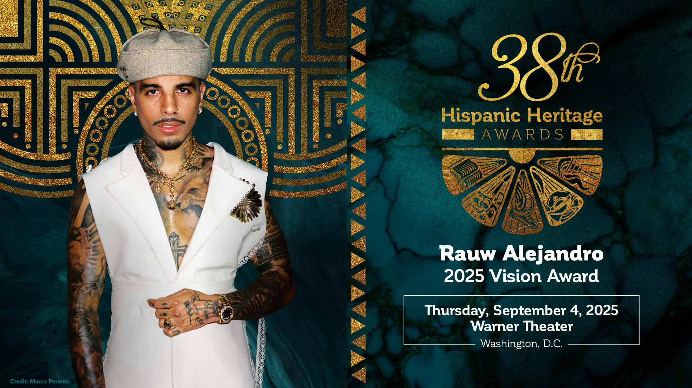

In 2025, Rauw Alejandro will receive one of the most important awards of his career: the Hispanic Heritage Award in the Vision category. This prestigious award celebrates leaders and artists who positively impact the Hispanic community and contribute to expanding culture internationally. Rauw's selection reflects the creative and transformative reach of his music.

The award highlights his musical innovation, his ability to experiment with genres, his futuristic artistic vision, and his influence on contemporary Latin music. With his fusion of Caribbean rhythms, electronic music, reggaeton, and alternative pop, Rauw has redefined the identity of urban sound globally.

Furthermore, his cultural impact goes beyond music. Rauw has become an icon of style, dance, and performance, inspiring young people from around the world to pursue creative careers. His dedication to reinventing himself and his authenticity have been key to his growth.

This recognition not only celebrates his current work, but also his potential as an influential figure in the years to come. Receiving the Hispanic Heritage Award reaffirms Rauw's role as one of the most visionary Latin artists of his generation.